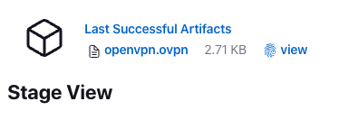

# OpenVPN Ephemeral Jenkins Template

## Overview

This repo provides an example template that supports a Jenkins pipeline building and destroying an OpenVPN EC2 server on demand. This template makes use of the [paulmarsicloud/openvpn-ephemeral/aws](https://registry.terraform.io/modules/paulmarsicloud/openvpn-ephemeral/aws/latest) Terraform Module and the pipeline is created using the [paulmarsicloud/terragrunt-awscli](https://hub.docker.com/r/paulmarsicloud/terragrunt-awscli) Docker container.

## Pre-requisites

In order to utilize this template repo, you will need:

- A running Jenkins instance
- Docker and Git installed on said Jenkins
- an AWS Account with an IAM user that has programmatic access
- OpenVPN Connect installed on your local machine

## Environment Variables

In order to use this template, simply clone/fork this repo, and update the following:

1. The `public_ip: <REPLACE ME>` environment variable in the `Jenkinsfile` with your local public IP address (e.g. `curl 4.ipaddr.io`)
2. Connect your Jenkins instance to your GitHub repo

## Start/Stop OpenVPN Ephemeral Server

1. When ready to use OpenVPN, click "Build Now" from the Jenkins Pipeline
2. Click on the Pipeline Run
3. Click on "Paused for Input" or hover over the Create VPN stage in the GUI:
   
4. Click "Yes" to Proceed - this will create the OpenVPN profile file for you
5. Wait for the Create VPN stage to complete
6. When completed, you can download the `openvpn.ovpn` artifact from the stage view:
   

   You can also go to Last Successful Artifacts and download from there too:
   

7. Open `openvpn.ovpn` on your local machine with your OpenVPN Connect application
8. When ready to destroy, simply disconnect from the OpenVPN Connect profile, go back to the Jenkins Pipeline GUI. Click on "Paused for Input" or hover over the Destroy VPN stage in the GUI:
   
9. Ensure that the pipeline destroys the Terraform resources successfully
